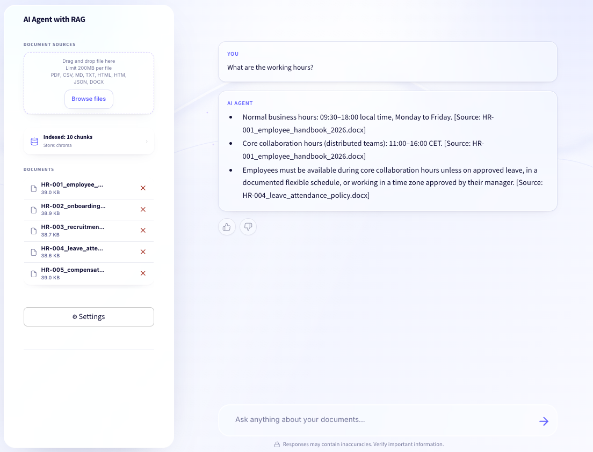

# rag-agent-v2



A small, hackable RAG agent. Hybrid retrieval (vector + BM25 fused with RRF), citations down to the page number, a feedback loop in sqlite, and a LangGraph state machine that knows when to ask for clarification, when to re-search, and when to give up. About ~1.2k lines of Python in two docker containers. Every file is under 200 lines; you should just read them.

I wrote this because most production RAG either disappears under five layers of `BaseRetrieverAgentRunnableExecutor`, or it's a 30-line LangChain demo that hallucinates the moment you give it a real corpus. I wanted something in between, with the four or five details that actually move the needle on quality.

## the graph

```
faq          regex lookup, no LLM. ("hello", "pricing")
 │
 ▼
clarify      LLM classifier. defaults hard to CLEAR; only fires
 │           on bare 1-2 word queries. returns a session_id so
 │           the user's follow-up gets spliced back in.
 ▼
analyze      LLM extracts metadata filters (file_name, page_number).
 │           gated: skipped unless the query has digits or a file ext.
 ▼
rag          LLM with a `search(query)` tool, up to 4 calls.
 │           primed with one eager retrieve so a model that
 │           ignores the tool still gets context.
 ▼
validate     LLM fact-check: VALID / INVALID.
 │
 ├── VALID ──▶ END
 ├── INVALID + attempts<2 ──▶ rewrite ──▶ rag (loop, max 2)
 └── INVALID + attempts==2 ──▶ escalate
```

A simple lookup runs `faq → clarify (CLEAR) → analyze (skip) → rag → validate (VALID) → END` — 3 LLM calls, ~2 s. A compound query like *"compare termination clauses in contract A and B"* might use four `search` tool calls plus one rewrite — 6-8 LLM calls, ~8 s. You only pay for the hard machinery when the question needs it.

## why hybrid retrieval

Pure vector is great until you ask about a part number, a person's name, or a contract ID — embeddings smear those into nearby concepts and your top-5 silently doesn't contain the actual chunk. So we run two retrievers in parallel — chroma for semantics, rank-bm25 for exact-match keywords — and fuse with [Reciprocal Rank Fusion](https://plg.uwaterloo.ca/~gvcormac/cormacksigir09-rrf.pdf) at `k=60`. RRF doesn't need score calibration: take ranks, add `1/(k+rank)`. Done.

There's one subtle bug almost every "hybrid retriever" tutorial has: when you fuse, BM25-only documents have to survive into the final result set. The naive thing is to look up each fused id in your vector results and silently drop it if it's not there. Don't do that. We build a single `id → NodeWithScore` map first, materializing a `TextNode` for BM25-exclusive hits from the stored text, *then* fuse. See [`hybrid.py:74`](app/retrieval/hybrid.py:74). I have lost hours to this.

The BM25 tokenizer is a one-line `re.compile(r"\w+", re.UNICODE)`. No stemmer, no stopwords. Works on Russian and English without special-casing.

## why page-level citations

The default llama-index PDF reader gives you `file_name` and that's it. To get `page_number`, you load the PDF page-by-page with PyMuPDF — that's what [`loader.py`](app/ingestion/loader.py) does. Each page becomes a `Document` with `page_number` in metadata, the chunker preserves it, and `format_citation` produces `[Source: contract.pdf, p. 12]` instead of just `[Source: contract.pdf]`. This is the single highest-leverage change for trust.

## install

```
cp .env.example .env  # add OPENAI_API_KEY
docker compose up -d --build
```

Two containers come up: `api` on `:8000`, `ui` on `:8501`, sharing a `./data` volume. The streamlit container talks to the API by service name (`http://api:8000`) for server-side calls but ships `PUBLIC_API_URL=http://localhost:8000` to the browser for client-side fetches. Two networks, one app, easy to get wrong.

## the retry loop

The `validate → rewrite → rag` loop is the most powerful node and the easiest to mis-tune. The good case: retrieve grabs irrelevant chunks, the LLM hedges or confabulates, validator catches it, rewriter turns *"when did the contract terminate"* into *"contract termination date"*, second retrieve returns better chunks, validate says VALID. Correct answer the user otherwise wouldn't have.

The bad case: validators (especially small ones) are often *too strict* and label correct answers INVALID, doubling the cost of borderline queries. We cap at 2 retries (`MAX_REWRITE_ATTEMPTS=2` in [supervisor.py:14](app/agent/supervisor.py:14)). If your validator is noisy, just delete the conditional edge and route INVALID straight to escalate. Three lines.

## tool-use

The RAG node binds a `search` tool to the chat model and runs a small loop: invoke, look at `tool_calls`, execute, append `ToolMessage`, repeat. Cap at 4. About 60 lines in [`rag_agent.py`](app/agent/rag_agent.py). No `create_react_agent`, no prebuilt graphs.

This is where the project earns the word "agent". Everywhere else, the LLM is classifying or rewriting. Only this node lets the model pick its own actions in a loop.

## things I didn't do

- **No re-ranker.** Cross-encoders would help on top-20 but add ~200 ms and another model dep. Hybrid+RRF is already strong. Add it after RRF in `hybrid.py`, ~30 lines.
- **No streaming.** `/api/query` is a synchronous `graph.invoke()`. Streaming the final answer requires plumbing through LangGraph's stream interface and re-thinking the validator/retry edges.
- **No multi-tenant.** sqlite, single chroma collection, single bm25 pickle.
- **No online learning.** Feedback is observation, not training. Thumbs go to sqlite, weekly report flags low-rated queries, you re-ingest or tweak prompts.

## things you'll hit if you push it

- BM25 is in-memory (a pickle, loaded once). Comfortable to ~50k chunks. Past that, separate process.
- sqlite + sync `sqlite3` + a threading lock is fine to ~5 RPS per instance. Past that, postgres.
- The OpenAI SDK does its own backoff on 429/5xx. We set `max_retries=3` and `timeout=60` so a stuck connection doesn't hang the whole graph.

## tests

```
pytest -q
```

17 tests, ~5 s. The interesting one is [`test_hybrid_includes_bm25_only_documents`](tests/test_hybrid.py) — regression for the bug above. End-to-end with a real key: `python run_e2e.py`.

## stack

LangGraph, llama-index (just the chunker and chroma adapter), ChromaDB, rank-bm25, PyMuPDF, FastAPI, Streamlit, sqlite, OpenAI (`gpt-5-mini` for the LLM, `text-embedding-3-small` for embeddings — both swappable via `.env`).

## license

MIT.
